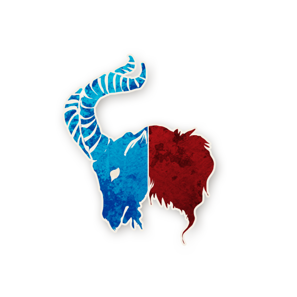
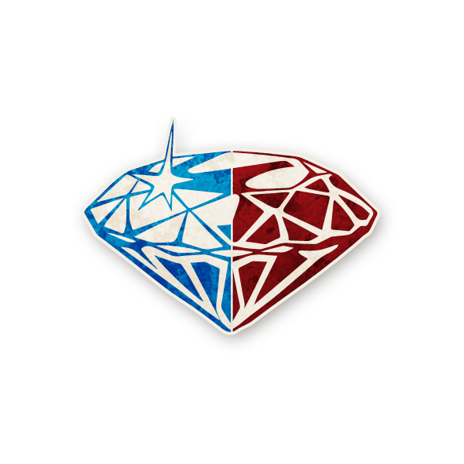
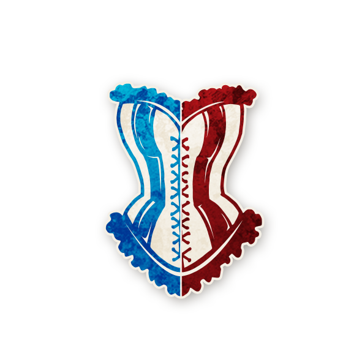
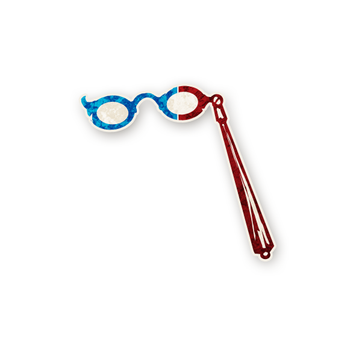
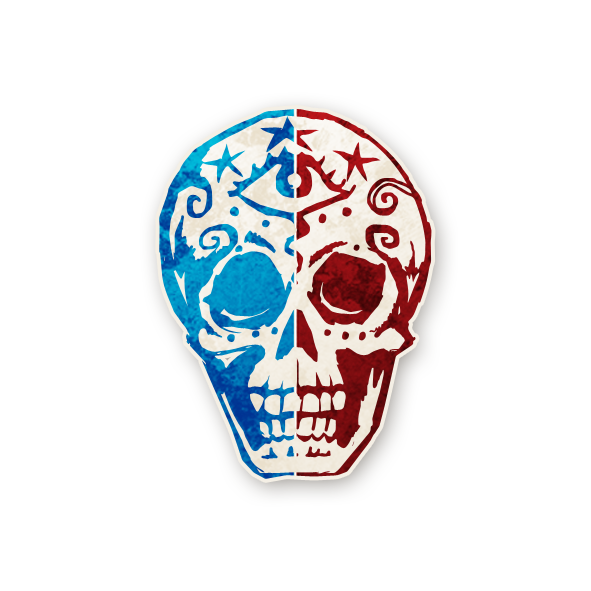
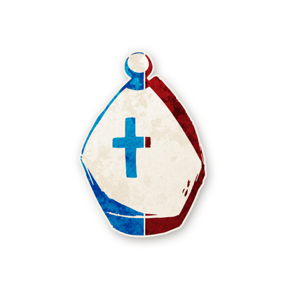

  

# Les Voyageurs

##  Présentation  

Les **Voyageurs** sont des rôles spéciaux pour les joueuses et joueurs qui arrivent en retard ou qui doivent partir tôt.  
Un Voyageur peut **rejoindre** la partie à tout moment, et **la quitter** à tout moment.  

- Les Voyageurs ont souvent des capacités extrêmement puissantes , mais obtiennent peu d’informations.  
- Ils ont **un maximum de pouvoir**… mais **un minimum de responsabilité**.  
- Si un Voyageur est **Maléfique **, il apprend qui est le [Démon](../demons.md).  
  (Mais il ne connaît pas les [Sbires](../sbires.md) et ne reçoit pas de bluffs.)  

---

## Sommaire  

1.  <a href="#-trouble-brewing" style="color:#b58b52; text-decoration:none; font-weight:bold;">Trouble Brewing</a> 
Les premiers Voyageurs, puissants et classiques.  

2.  <a href="#-sects--violets" style="color:#d67bff; text-decoration:none; font-weight:bold;">Sects & Violets</a> 
Des rôles étranges, vivants et imprévisibles.  

3.  <a href="#-bad-moon-rising" style="color:#ffa64d; text-decoration:none; font-weight:bold;">Bad Moon Rising</a> 
Des Voyageurs audacieux, dangereux et spectaculaires.  

4.  <a href="#-expérimentaux" style="color:#e0c99d; text-decoration:none; font-weight:bold;">Expérimentaux</a> 
Des créations originales, en phase de test.

---

##  Trouble Brewing 

  <a href="./scapegoat.html" style="text-decoration:none;">
     
    Bouc Émissaire
  </a>

  <a href="./gunslinger.html" style="text-decoration:none;">
     
    Gunslinger
  </a>

  <a href="./beggar.html" style="text-decoration:none;">
     
    Mendiant
  </a>

  <a href="./bureaucrat.html" style="text-decoration:none;">
     
    Bureaucrate
  </a>

  <a href="./thief.html" style="text-decoration:none;">
     
    Voleur
  </a>

---

##  Sects & Violets

  <a href="./butcher.html" style="text-decoration:none;">
     
    Boucher
  </a>

  <a href="./bonecollector.html" style="text-decoration:none;">
     
    Collecteur d’os
  </a>

  <a href="./harlot.html" style="text-decoration:none;">
     
    Harlot
  </a>

  <a href="./barista.html" style="text-decoration:none;">
     
    Barista
  </a>

  <a href="./deviant.html" style="text-decoration:none;">
     
    Déviant
  </a>

---

##  Bad Moon Rising  

  <a href="./apprentice.html" style="text-decoration:none;">
     
    Apprenti
  </a>

  <a href="./matron.html" style="text-decoration:none;">
     
    Matrone
  </a>

  <a href="./voudon.html" style="text-decoration:none;">
     
    Voudon
  </a>

  <a href="./judge.html" style="text-decoration:none;">
     
    Juge
  </a>

  <a href="./bishop.html" style="text-decoration:none;">
     
    Évêque
  </a>

---

##  Expérimentaux

  <a href="./cacklejack.html" style="text-decoration:none;">
     
    Cacklejack
  </a>

  <a href="./gangster.html" style="text-decoration:none;">
     
    Gangster
  </a>

  <a href="./gnome.html" style="text-decoration:none;">
     
    Gnome
  </a>

---

 <a href="/botc-fr-bambi/" style="color:#f5f5f5; font-weight:bold; text-decoration:none;">Retour à l’accueil</a> 
 <a href="./voyageurs.html" style="color:#9b59b6; font-weight:bold; text-decoration:none;">Retour aux Voyageurs</a>

